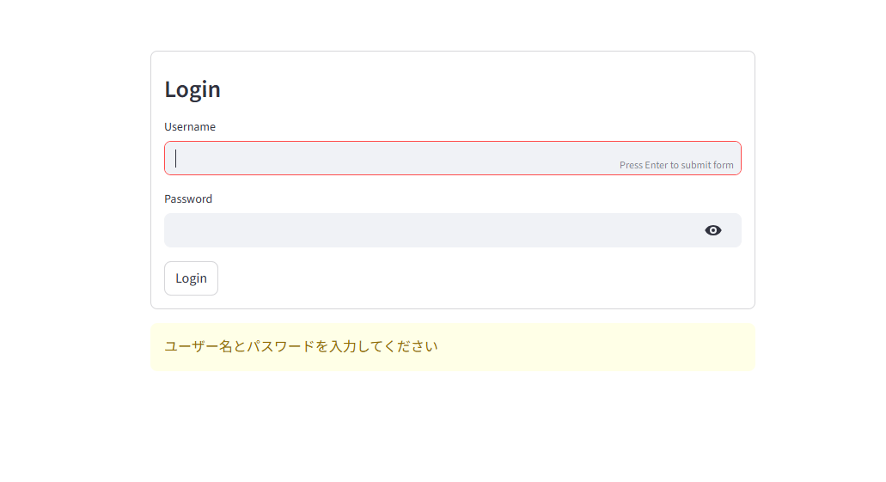
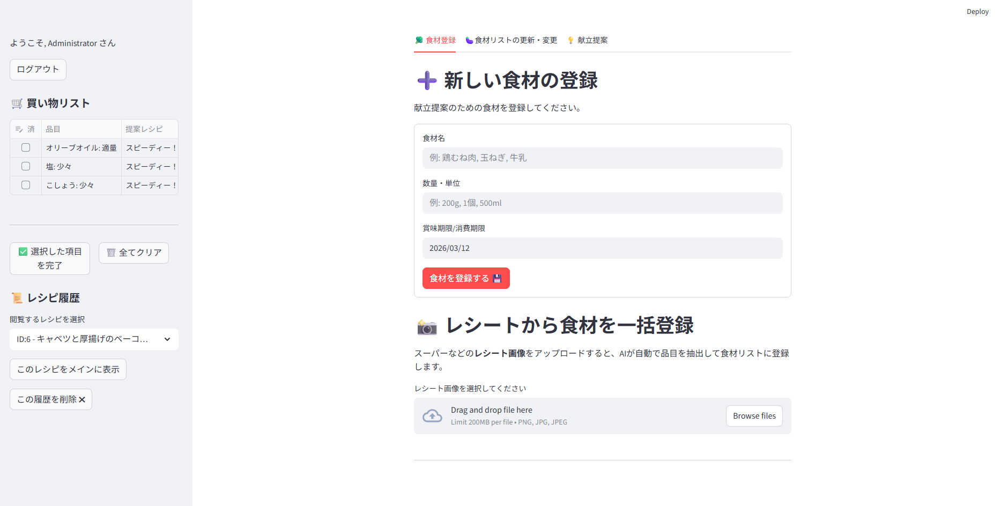
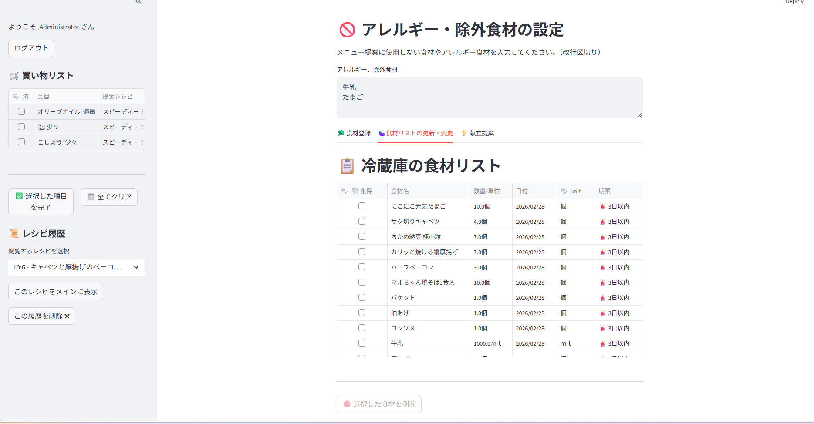
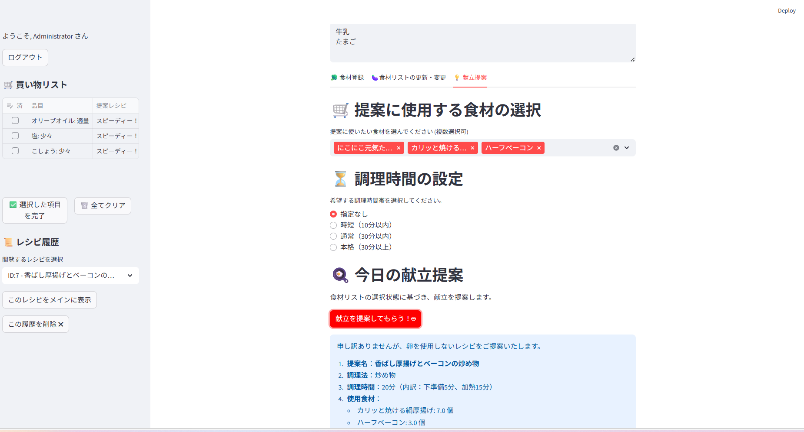
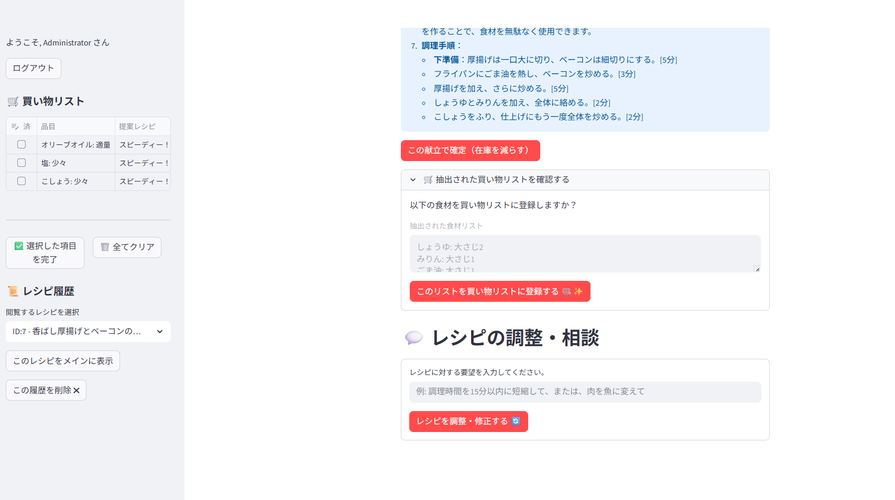

# 献立提案アプリ

ポートフォリオとして制作したWebアプリです。  
冷蔵庫の食材を管理し、在庫情報をもとにAIが献立を提案します。
## アプリ画面

### ログイン画面

### 食材登録画面

### 食材リスト画面

### AI献立提案画面

### 献立調整画面

## デモ動画 
約6分の動画です。
---------------------------------------------------
https://youtu.be/Ey6x3xG0eVo?si=uw24lrmeOTfG6ZGT

## アプリの概要

冷蔵庫の中にある食材を登録・一覧表示・削除、献立提案できるアプリです。
家族が毎日献立を考えるのが大変という問題を解決したいと思い制作しました。

## 制作の目的

・Webアプリの基本的な仕組みを理解するため  
・データベースを使ったCRUD処理を学ぶため  
・Git / GitHubの使い方に慣れるため  

## 使用技術
フロントエンド  
Streamlit

バックエンド  
Python

データベース  
SQLite

ORM  
SQLAlchemy

AI  
OpenAI API

## 主な機能

・ログイン機能  
・食材登録（手動 / レシート自動登録）  
・在庫管理（消費期限表示）  
・AI献立提案（OpenAI API）  
・買い物リスト生成  
・レシピ履歴管理

## 機能詳細

1. **ログイン機能**
   - セキュリティのため、簡易的なログインシステムを搭載。
     
2. **手動・自動での食材登録システム**
   - ユーザーが細かく食材名や数量と消費期限を設定できるように手動での登録ができる
   - 買い物したレシートから一括で食材だけが登録できるように自動登録
       
3. **在庫管理システム**
   - 冷蔵庫内の食材、数量、単位、消費期限をデータベースで管理。
   - 食材の使用後は、数量の自動減算や使い切り時の自動削除が可能。
   - 消費期限が近いものをアイコンで表示
   
4. **食材リストの編集システム**
   - 登録した食材の数量・単位を手動で変更できる。
   - 食材の削除がしやすいようにリストにチェックを入れて削除できる
     
5. **AI献立提案（OpenAI GPT-4o 連携）**
   - 選択した食材または現在の在庫状況を考慮したレシピを提案。
   - アレルギー設定に基づいた安全なレシピ作成。
   - 「調理時間を15分に短縮して」といった対話形式のレシピ調整機能。

6. **スマート買い物リスト**
   - AIが提案レシピから「不足食材」を自動抽出。
   - ワンクリックで買い物リストへ登録。
   - チェックボックスでの削除、一括でリストを削除することも可能

7. **レシピ履歴管理**
   - 過去に提案されたお気に入りレシピをいつでも振り返ることが可能。
   - レシピの履歴を削除することも可能

## 工夫した点

・初心者でも見やすいシンプルな画面設計  
・処理の流れが分かりやすいコードを書くことを意識  
・Streamlitのフォーム入力履歴が残る問題を、ランダムなキーを割り当てることで解決  
・AI回答の形式を固定するプロンプトを設計し、後続処理を簡潔化  
・ページが縦長になりすぎないようタブUIを導入  
・献立に使用した食材をリストから自動減算できるよう、数量と単位を分離する関数を実装

## 今後の改善点

・Docker化
・デザインの改善  
・ログイン機能での、ユーザー名の変更やパスワードを変更できるようにする

## 学んだこと

・フロントエンドとバックエンドのつながり  
・データベースとアプリの連携方法  
・エラーが出たときの調べ方  

まだまだ勉強中ですが、Webアプリ開発の流れを一通り経験することができました。
